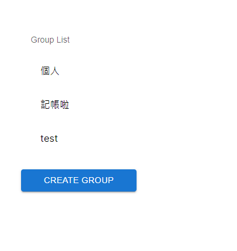
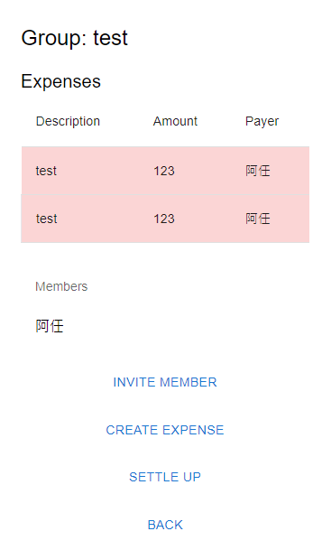
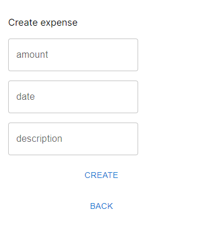
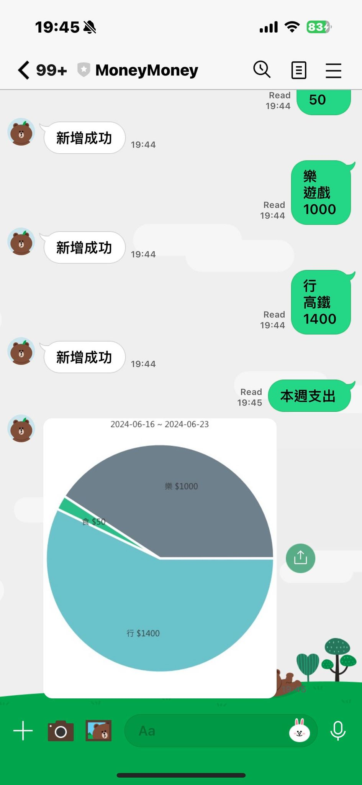

# Bill Splitting 分帳系統
Bill Splitting 是一種財務管理工具，旨在簡化和自動化在多個參與者之間分配費用和付款的過程。這種系統特別適用於團體旅遊、合租居住、共同活動或任何涉及多方共同支付費用的情境。使用分帳系統，用戶可以輕鬆追蹤共同支出，並確保每個人公平地分攤費用。除了提供網頁服務，也可以透過 Line Bot 進行記帳。

網站: http://arensusu.ddns.net/

Line Bot: https://liff.line.me/1645278921-kWRPP32q/?accountId=401xxaib

## 專案技術
- Golang：後端開發語言
- Gin：The fastest full-featured web framework for Go
- Postgres：The World's Most Advanced Open Source Relational Database
- sqlc：A SQL compiler
- jwt-go：A go implementation of JSON Web Tokens
- goth：Multi-Provider Authentication for Go
- testify：A toolkit with common assertions and mocks that plays nicely with the standard library
- mock：GoMock is a mocking framework for the Go programming language.
- Next.js：前端框架
- linebot
- docker
- AWS Lightsail

## 功能
- **記錄支出**：用戶能夠輸入每筆支出的細節，包括金額、日期和支出類別。
- **分攤費用**：系統會根據預設的規則或用戶的指定，自動計算每個人的應付分攤金額。
- **債務整合**：為了簡化償還過程，系統會分析所有債務和應收帳款，提供最優化的償還方案。
- **交易記錄和報告**：用戶可以查看他們的支出歷史、欠款和應收款項，並且獲取財務報告。

## 使用方法
1. 使用 Line 帳號登入系統
2. 建立分帳群組
3. 建立邀請連結，邀請朋友加入，每個連結只能使用一次
4. 建立新的支出 (日期、金額、說明)
5. 結算，產生成員欠款及應收款項的明細

## 畫面展示

群組總覽

群組帳務明細

新增支出

Line Bot

